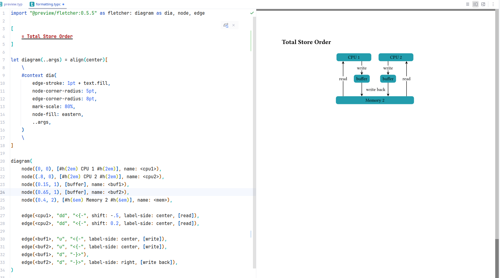
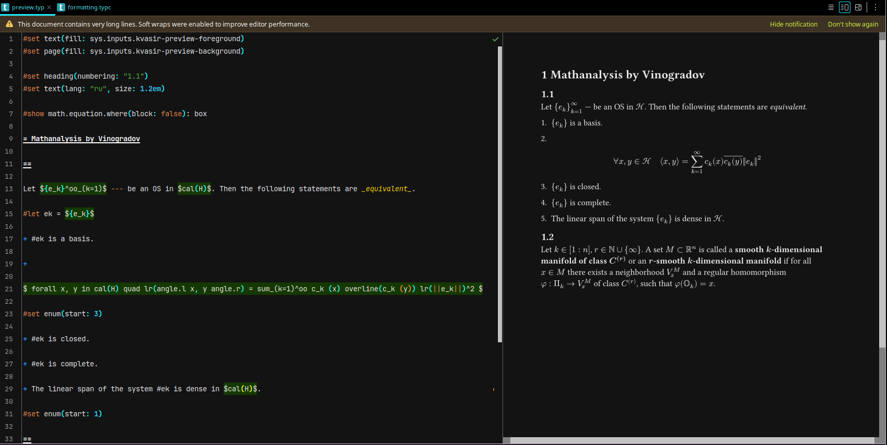

<div align="right"><p style='align: right;'>
Languages: <a href="README-RU.md"></a> <a href="README.md"></a> 
</p></div>

# Kvasir

Kvasir (/kwɑ'zer/) — это (неофициальный) плагин для JetBrains Platform, добавляющий поддержку для языка разметки [Typst](https://typst.app/docs).

__*Будьте внимательны! В этом репозитории содержится версия 0.3.0, которая ещё не была проверена командой JetBrains, но вы можете установить его вручную с диска. Новая версия значительно быстрее и содержит больший функционал.*__

__*Важное x2! Этот проект не заброшен, хоть и может выглядеть таковым. Я исследовал различные варианты уменьшения размера дистрибутива и обеспечения стабильности на разных платформах; и я рад сообщить, что эти исследования, похоже, завершены. Это значит, что в скором времени я смогу вернуться к разработке TyKo и Kvasir. Однако работы ещё много, так что, пожалуйста, наберитесь терпения xD*__




## Функционал

- Настраиваемая подсветка синтаксиса
- Включения кода (код в raw блоках подсвечивается соответственно языку)
- Моментальный предпросмотр, с возможностью подстройки под тему (цвета фона и текста передаются в `sys.inputs.kvasir-preview-background` и `-foreground` соответственно)
- Отображение ошибок компиляции
- Простые code actions (закомментировать код, автоматическая вставка закрывающих элементов)
- Форматирование (использует [typstyle](https://github.com/Enter-tainer/typstyle))
- `typc` (для кода) и `typm` (для математики) поддерживаются наравне с `typ`, со всеми перечисленными фичами.

Плагин находится в бета-стадии, большая часть функционала ещё в разработке. 
См. "_Roadmap_" для информации о планируемых функциях, "_Ближайшие планы_"  для информации о текущей разработке. 
Не стесняйтесь открывать issue или создавать pull request'ы.

## Установка

Плагин можно установить с диска с помощью [архива](distributions/Kvasir-0.3.0-signed.zip),
или из JetBrains Marketplace по названию. Из коробки он, пока что, поддерживает только четыре платформы:

- x86-64, Windows
- x86-64, Linux
- x86-64, Darwin (MacOS, iOS, etc.)
- AArch64 (ARM64), Darwin

Если у вас другое сочетание операционной системы и архитектуры, вам потребуется дополнительная настройка:

1. [Установите cargo](https://doc.rust-lang.org/cargo/getting-started/installation.html), если у вас его нет.

1. Скачайте и соберите библиотеку:
    ```sh
    git clone https://github.com/LDemetrios/typst-shared-library
    cd typst-shared-library
    cargo build --release
    ```
1. Скопируйте результат сборки (будет в `target/release/`) куда-нибудь в ваш PATH.
   Файл должен иметь имя `libtypst_shared.so` для Linux, `typst_shared.dll` для Windows,
   `libtypstr_shared.dylib` для Darwin, для других ОС можно проверить, посмотрев на результат `System.mapLibraryName("typst_shared")`, вызванного в Java.

1. Перезагрузите IDE, возможно, перевключите или переустановите Kvasir.

Если у вас всё ещё возникают ошибки при открытии Typst файлов, открывайте issue.

Также вы можете внести вклад в [репозиторий shared-library](https://github.com/LDemetrios/typst-shared-library),
отредактировав `compile.sh` или `.github/workflows/release.yml`, так, чтобы я смог предоставить поддержку для вашей платформы в будущих версиях. К сожалению, с моим x86 процессором и GitHub ci мне не удалось скомпилировать под другие платформы.

## Roadmap, Планы, Changelog

См. [Roadmap](Roadmap-RU.md) и [Changelog](Changelog-RU.md).

**Nearest plans**

- (В 0.4) Определение имён и связанные фичи (go-to-definition, find usages, renaming)
- (В 0.5) Настраиваемая стандартная библиотека и дефолтные стили документа.

## Известные проблемы

- `inputs`, передаваемые документу плагином, не меняются при смене темы, вплоть до перезагрузки IDE.

## Контакты

Telegram: @LDemetrios
Почта: ldemetrios@yandex.ru
