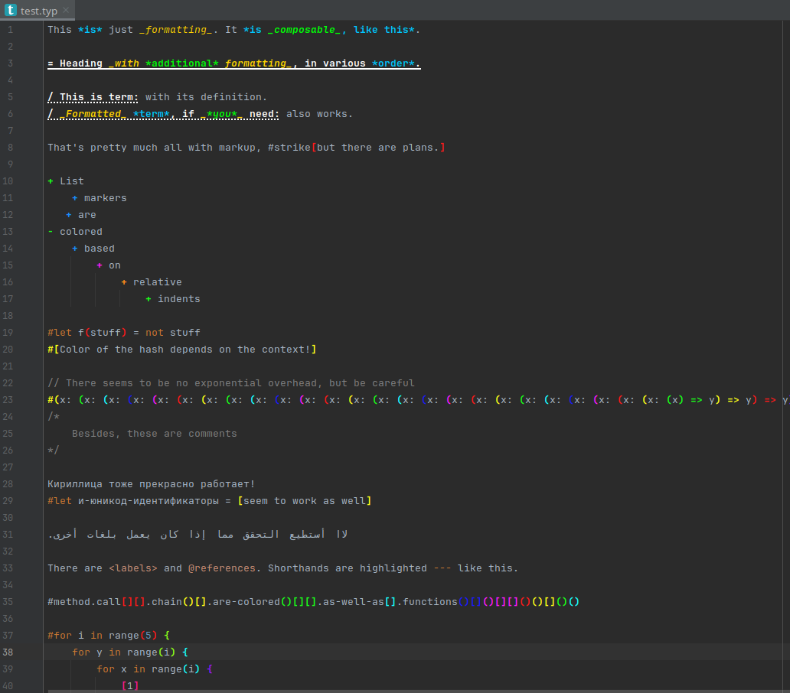

# Kvasir

Kvasir is an (unofficial) Intellij IDEa plugin adding support for [Typst](https://typst.app/docs) language.

## Features

- Customizable syntax highlight

The plugin is in beta stage, a lot of features are yet to come. 
See _Roadmap_ for the information about planned features, 
and _Nearest plans_ for those which are currently in development. 
Feel free to open issues and pull requests.

## Installation

The plugin can be manually installed from disk [archive](distributions/Kvasir-a.1.0-signed.zip), 
or from JetBrains Marketplace by name.

## Roadmap
(Before opening a feature request make sure it's not already planned)

Listed by group, not by priority (see _Nearest plans_ for those)

- Highlighting
  - [X] Basic Typst formatting
  - [X] Rainbow brackets
  - [ ] Math support
  - [ ] Error recovery (one error shouldn't bust highlighting for the rest of the file)
  - [ ] Language injections: highlight raw code due to its actual language
- Preview and Compiler errors (integrate Typst-Preview)
- Formatter
  - [ ] Sketch formatter (integrate typstfmt or typstyle)
  - [ ] Intellij-based, configurable formatter
- Indexing
  - [ ] Go to definition, renaming, find usages
  - [ ] Hover tips
  - [ ] Inlay hints
  - [ ] Documentation pop-ups
- Scope recognition
  - [ ] Folding ranges
  - [ ] Highlighting current scope
  - [ ] Colored guides
- Code Actions
  - [ ] Commenter
  - [ ] "Surround with" (shortcuts for making text italic, bold, etc)
  - [ ] Introduce variable
  - [ ] Pattern recognition (how am I gonna do that? omg)
- Project-level support
  - [ ] Gradle plugin
  - [ ] IDEa project template
  - [ ] Typst project template

## Nearest plans

- Error recovery
- Sketch formatter
- Preview and Compiler errors
- Go to definition, renaming, find usages

