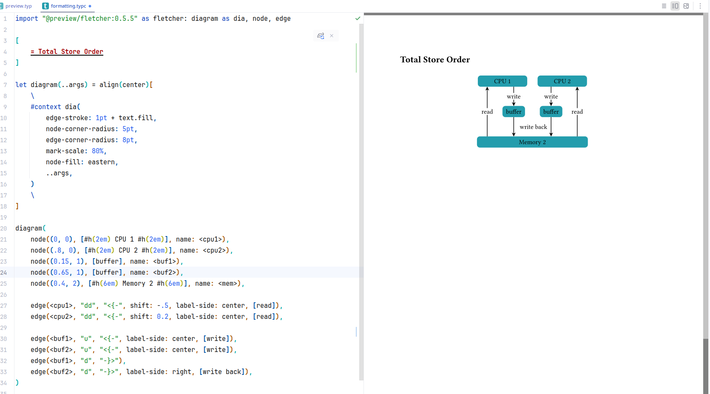
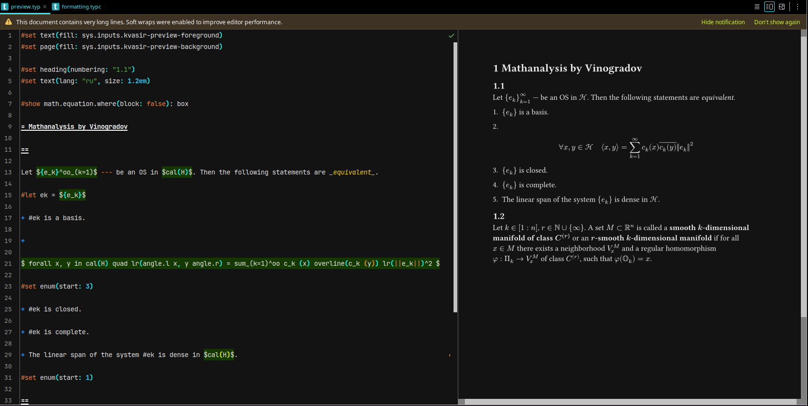

Languages:   

# Kvasir

Kvasir (/kwɑ'zer/) is an (unofficial) plugin for JetBrains platform adding support for [Typst](https://typst.app/docs) language.

Current repository version: **0.4.0**, which at last aligns with the Marketplace again.

## Features

- Customizable syntax highlight
- Code injections (code in raw blocks is highlighted according to its language)
- Instant theme-aware preview (background and foreground colors are accessible via `sys.inputs.kvasir-preview-background` and `-foreground` respectively)
- Compilation errors and warnings display
- Simple code actions (comment out code, surround-with)
- Formatter (based on [typstyle](https://github.com/Enter-tainer/typstyle))
- `typc` (for code) and `typm` (for math) are supported as well as `typ`, with all the aforementioned features.
- Kvasir settings are available under Settings/Tools/Kvasir. See [respective readme part](README.md#settings)

The plugin is in the beta stage, a lot of features are yet to come. 
See _Roadmap_ for the information about planned features. 
Feel free to open issues and pull requests.

## Installation

The plugin can be installed from JetBrains Marketplace by name, or manually from disk with [archive](distributions/Kvasir-0.4.0.zip).
The old manual setup for `typst-shared-library` is no longer required.

## Settings 

- **Text width**: target line width, in characters, passed to the formatter. Default: `120`.
- **Tabulation size**: number of spaces in one indentation level used by the formatter. Default: `4`.
- **Rainbowify brackets**: color matching brackets and related punctuation by nesting level. Enabled by default.
- **Allow scrolling beyond document boundaries**: let the preview viewport move past the rendered page edges instead 
  of clamping to the document bounds. Disabled by default.
- **Scrolling speed**: multiplier for mouse-wheel preview scrolling.
- **Zoom speed**: multiplier for Ctrl+mouse-wheel preview zooming. 
- **Break-glass ticket** _(experimental)_: enables privileged JVM access from Typst documents through upcall functions.
  (docs will appear in https://github.com/LDemetrios/TyKo some time in the future, probably)
- **Suppress compilation**: disables preview compilation and compilation diagnostics. Disabled by default.
- **Preserved comemo cache age**: how long TyKo runtime cache entries are preserved after compilation. Lower values use more CPU, higher values use more RAM. 
  Default: `20`. For reference, `typst watch` uses `10`.

## Roadmap, Plans, Changelog

See [Roadmap](Roadmap.md) and [Changelog](Changelog.md).

## Known bugs

- Embedded SVGs might be not rendered in the Preview.

## Contacts

Telegram: @LDemetrios

Mail: ldemetrios@yandex.ru

## Acknowledgements

Kvasir builds on work from several open-source projects:

- Amazing [Typst](https://typst.app/) team for the language, and for advices in development
- Incredible [Chicory](https://github.com/dylibso/chicory) creators and contributors, for their WASM runtime, and for guidance in using it
- Marvelous [Typstyle](https://github.com/Enter-tainer/typstyle) creators and contributors, for their formatter
