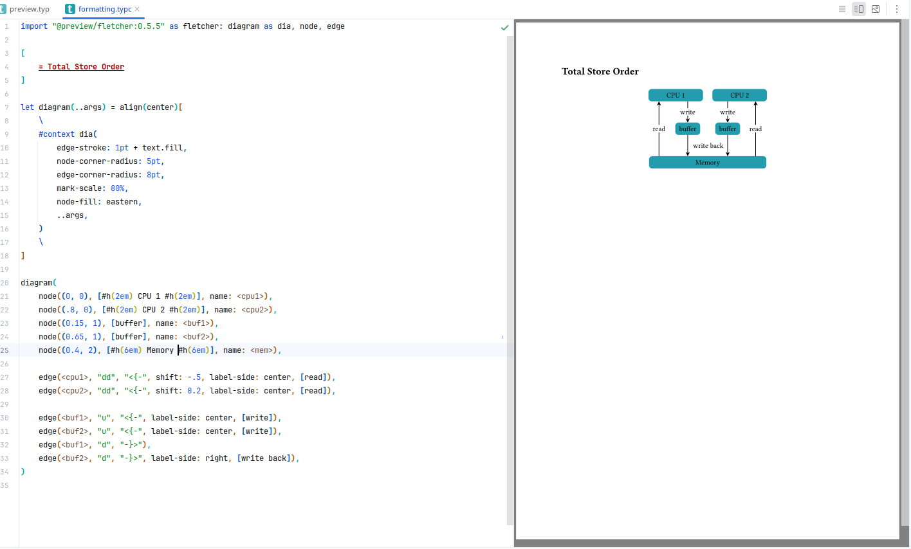

# Kvasir

Kvasir (/kwɑ'zer/) is an (unofficial) Intellij IDEa plugin adding support for [Typst](https://typst.app/docs) language.




## Features

- Customizable syntax highlight
- Code injections (code in raw blocks is highlighted according to its language)
- Instant theme-aware preview (background and foreground colors are accessible via `sys.inputs.kvasir-preview-background` and `-foreground` respectively)
- Compilation errors and warnings display
- Simple code actions (comment out code, surround-with)
- Formatter (based on [typstyle](https://github.com/Enter-tainer/typstyle))
- `typc` (for code) and `typm` (for math) are supported as well as `typ`, with all the aforementioned features.

The plugin is in the beta stage, a lot of features are yet to come. 
See _Roadmap_ for the information about planned features, 
and _Nearest plans_ for those which are currently in development. 
Feel free to open issues and pull requests.

## Installation

The plugin can be manually installed from disk with [archive](distributions/Kvasir-0.3.0-signed.zip), 
or from JetBrains Marketplace by name. Out of the box it supports only four platforms at the time:

- x86-64, Windows
- x86-64, Linux
- x86-64, Darwin (MacOS, iOS, etc.)
- AArch64 (ARM64), Darwin

If you have another combination of OS and Architecture, you'll need additional setup:

1. [Install cargo](https://doc.rust-lang.org/cargo/getting-started/installation.html), if you don't have it

1. Download and build shared library:
    ```sh
    git clone https://github.com/LDemetrios/typst-shared-library
    cd typst-shared-library
    cargo build --release
    ```
1. Copy the resulting library (will be in `target/release/`) anywhere into your PATH.
   The file should be named `libtypst_shared.so` for Linux, `typst_shared.dll` for Windows, 
   `libtypstr_shared.dylib` for Darwin, for other OSes it can be checked with `System.mapLibraryName("typst_shared")` from Java.

1. Restart IDE, possibly reenable or reinstall Kvasir.

If after this you still get an error when opening Typst files, feel free to open an issue. 

You can also contribute to the [shared-library repo](https://github.com/LDemetrios/typst-shared-library) 
by either editing `compile.sh` or `.github/workflows/release.yml`, so I will be able to include support 
for your platform in future releases. Unfortunately, using my poor x86 processor and GitHub CI,  
I failed to compile to anything except these four targets.

## Roadmap, Plans, Changelog

See [Roadmap](Roadmap.md) and [Changelog](Changelog.md).

**Nearest plans**

- (In 0.4) Name resolution and related features (go-to-definition, find usages, renaming).
- (In 0.5) Customizing std library and default document styles.


## Known bugs

- `inputs`, provided by Kvasir, don't change when theme is changed, until IDE restart.

## Contacts

Telegram: @LDemetrios
Mail: ldemetrios@yandex.ru
